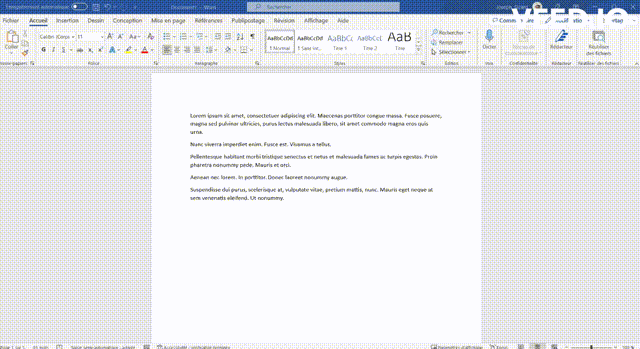

# Raccourcis Windows

<!-- TODO compléter le paragraphe introductif -->
Documentation de raccourcis Windows intéressants à connaître pour un développeur.

### Couper

**Combinaison de touches :** *CTRL* -*X*  ou *MAJ* - *suppr*

**Description :** Coupe le texte selectionné dans le presse papier

**Visuel :** 

**Catégories :** Gestion du texte, MISC