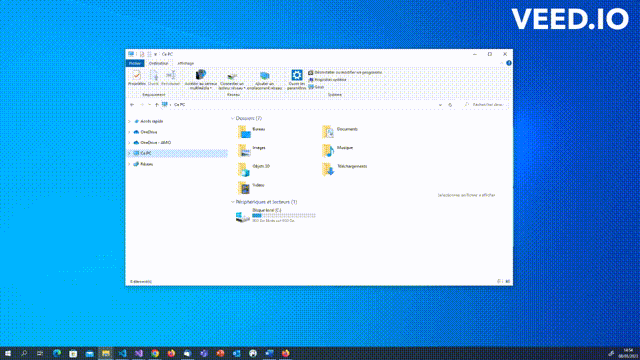
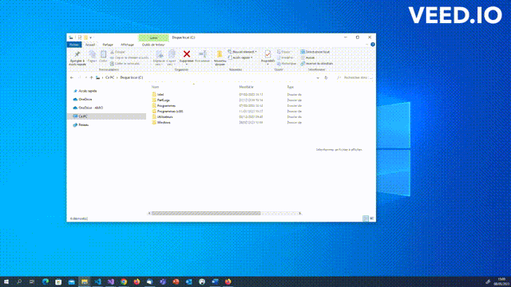

# Raccourcis Windows

Documentation de raccourcis Windows intéressants à connaître pour un développeur.

### Tout sélectionner

**Combinaison de touches :** *CTRL* - *A*

**Description :** Selection de tout le document

**Visuel :** 

**Catégories :** Gestion du texte, MISC

### Copier une sélection de texte, un dossier ou une image

**Combinaisons de touches :** *CTRL* - *C* ou *CTRL* - *INSER*

**Description :** Les raccourcis permettent de copier une sélection de texte, un dossier ou une image. Il faut sélectionner l'élément, maintenir la touche CTRL (Control) du clavier enfoncée et cliquer sur la lettre C, ou maintenir la touche CTRL (Control) du clavier enfoncée et cliquer sur la touche INSER.

**Visuel :** 

**Catégories :** Gestion du texte , Gestion du presse-papiers

### Ouvrir une nouvelle fenêtre

**Combinaison de touches :** *CTRL* - *N*

**Description :** Le raccourci permet d'ouvrir une nouvelle fenêtre. Il faut maintenir la touche CTRL (Control) du clavier enfoncée et cliquer sur la lettre N.

**Visuel :** 

**Catégories :** Gestion du bureau et des fenêtres

### Créer un nouveau dossier dans l'explorateur de fichiers

**Combinaison de touches :** *CTRL* - *MAJ* - *N*

**Description :** Le raccourci permet de créer un nouveau dossier dans l'explorateur de fichiers. Il faut maintenir les touches CTRL (Control) et MAJ du clavier enfoncée et cliquer sur la lettre N.

**Visuel :** 

**Catégories :** MISC
