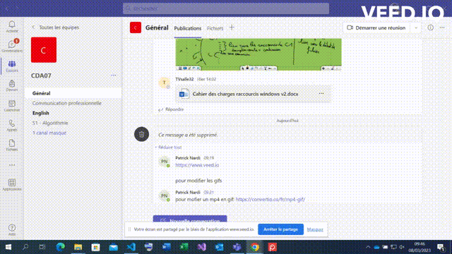

# Raccourcis Windows

<!-- TODO compléter le paragraphe introductif -->

Documentation de raccourcis Windows intéressants à connaître pour un développeur.

### Naviguation entre les fenêtres

**Combinaison de touches :** ALT - TAB

**Description :** Naviguer entre les fenêtres

**Visuel :** 

**Catégories : B** Gestion du bureau et des fenêtres.
