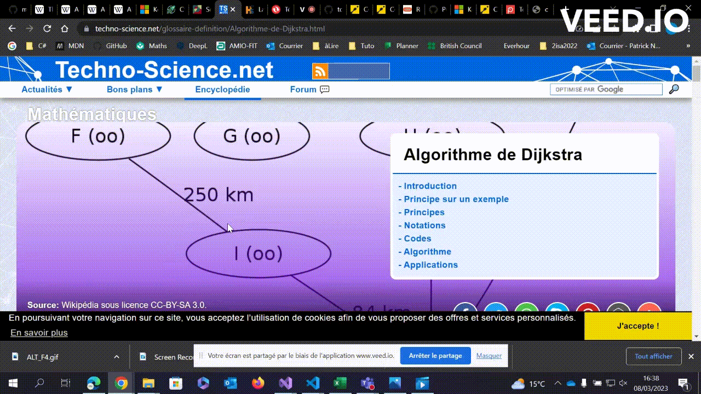
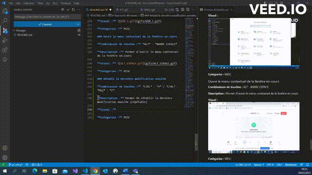

# Raccourcis Windows

Documentation sur des raccourcis Windows intéressants à connaître pour un développeur. Ce document est composé de plusieurs catégories redirigeant vers les raccourcis liés.
Les raccourcis sont présents en fin de document, après les catégories.
Des liens entre les différentes parties du document seront présents afin d’améliorer la navigabilité. 

## Sommaire des catégories

[Gestion du texte](#gestion-du-texte)

[Gestion du bureau et des fenêtres](#gestion-du-bureau-et-des-fenêtres)

[Gestion du presse-papier](#gestion-du-presse-papier)

[MISC](#misc)

[Raccourcis commençant par F\<chiffre>](#raccourcis-commençant-par-fchiffre)

[Raccourcis commençant par CTRL](#raccourcis-commençant-par-ctrl)

[Raccourcis commençant par WIN](#raccourcis-commençant-par-win)

[Raccourcis commençant par MAJ](#raccourcis-commençant-par-maj)

[Raccourcis commençant par ALT](#raccourcis-commençant-par-alt)

## Catégories

### Gestion du texte

[Sélectionner tout le document](#sélectionner-tout-le-document)

[Copier une sélection de texte, un dossier ou une image](#copier-une-sélection-de-texte-un-dossier-ou-une-image)

[Ouvrir le gestionnaire des tâches](#ouvrir-le-gestionnaire-des-tâches)

[Couper une sélection de texte, un dossier ou une image](#couper-une-sélection-de-texte-un-dossier-ou-une-image)

[Placer le curseur au début ou à la fin de la ligne](#placer-le-curseur-au-début-ou-à-la-fin-de-la-ligne)

[Déplacer le curseur au début ou à la fin du fichier](#déplacer-le-curseur-au-début-ou-à-la-fin-du-fichier)

[Sélectionner mot par mot](#sélectionner-mot-par-mot)

[Coller une sélection de texte, un dossier ou une image](#coller-une-sélection-de-texte-un-dossier-ou-une-image)

[Effacer un mot](#effacer-un-mot)

[Sélectionner le texte, lettre par lettre](#sélectionner-le-texte-lettre-par-lettre)

[Entrer ou sortir du mode insertion](#entrer-ou-sortir-du-mode-insertion)

[Effacer le texte entre le curseur et la fin du mot](#effacer-le-texte-entre-le-curseur-et-la-fin-du-mot)

[Sélectionner le texte entre le curseur et le début ou la fin du document](#sélectionner-le-texte-entre-le-curseur-et-le-début-ou-la-fin-du-document)

[Sélectionner le texte entre le curseur et le début ou la fin de la ligne](#sélectionner-le-texte-entre-le-curseur-et-le-début-ou-la-fin-de-la-ligne)

### Gestion du bureau et des fenêtres

[Afficher les tâches](#afficher-les-tâches)

[Naviguer entre les fenêtres](#naviguer-entre-les-fenêtres)

[Afficher ou masquer toutes les fenêtres](#afficher-ou-masquer-toutes-les-fenêtres)

[Déplacer la fenêtre en cours d’un écran à l’autre](#déplacer-la-fenêtre-en-cours-dun-écran-à-lautre)

[Fermer la fenêtre active](#fermer-la-fenêtre-active)

[Ouvrir une nouvelle fenêtre](#ouvrir-une-nouvelle-fenêtre)

### Gestion du presse-papier

[Afficher l'historique du presse papier](#afficher-lhistorique-du-presse-papier)

[Couper une sélection de texte, un dossier ou une image](#couper-une-sélection-de-texte-un-dossier-ou-une-image)

[Copier une sélection de texte, un dossier ou une image](#copier-une-sélection-de-texte-un-dossier-ou-une-image)

[Coller une sélection de texte, un dossier ou une image](#coller-une-sélection-de-texte-un-dossier-ou-une-image)

### MISC

[Sélectionner tout le document](#sélectionner-tout-le-document)

[Ouvrir le menu exécuter](#ouvrir-le-menu-exécuter)

[Annuler la dernière modification](#annuler-la-dernière-modification)

[Ouvrir la page des propriétés du PC](#ouvrir-la-page-des-propriétés-du-pc)

[Ouvrir le menu démarrer](#ouvrir-le-menu-démarrer)

[Sauvegarder le fichier actif](#sauvegarder-le-fichier-actif)

[Passer en plein écran ou revenir avec un affichage normal](#passer-en-plein-écran-ou-revenir-avec-un-affichage-normal)

[Lancer la saisie vocale](#lancer-la-saisie-vocale)

[Fermer la fenêtre active](#fermer-la-fenêtre-active)

[Actualiser la fenêtre active](#actualiser-la-fenêtre-active)

[Ouvrir le menu contextuel de la fenêtre en cours](#ouvrir-le-menu-contextuel-de-la-fenêtre-en-cours)

[Naviguer mot par mot](#naviguer-mot-par-mot)

[Rechercher dans la page ou dans l'application ouverte](#rechercher-dans-la-page-ou-dans-lapplication-ouverte)

[Mettre fin à une action en cours](#mettre-fin-à-une-action-en-cours)

[Ouvrir le menu des liens rapides](#ouvrir-le-menu-des-liens-rapides)

[Activer ou désactiver les touches rémanentes](#activer-ou-désactiver-les-touches-rémanentes)

[Rétablir la dernière modification annulée](#rétablir-la-dernière-modification-annulée)

[Créer un nouveau dossier dans l'explorateur de fichiers](#créer-un-nouveau-dossier-dans-lexplorateur-de-fichiers)

### Raccourcis commençant par F\<chiffre>

[Renommer l'élément sélectionné](#renommer-lélément-sélectionné)

[Rechercher dans la page ou l'application ouverte](#rechercher-dans-la-page-ou-lapplication-ouverte)

[Actualiser la fenêtre active](#actualiser-la-fenêtre-active)

[Passer en plein écran ou revenir avec un affichage normal](#passer-en-plein-écran-ou-revenir-avec-un-affichage-normal)

### Raccourcis commençant par CTRL

[Sélectionner tout le document](#sélectionner-tout-le-document)

[Copier une sélection de texte, un dossier ou une image](#copier-une-sélection-de-texte-un-dossier-ou-une-image)

[Couper une sélection de texte, un dossier ou une image](#couper-une-sélection-de-texte-un-dossier-ou-une-image)

[Ouvrir le gestionnaire des tâches](#ouvrir-le-gestionnaire-des-tâches)

[Annuler la dernière modification ](#annuler-la-dernière-modification)

[Sauvegarder le fichier actif](#sauvegarder-le-fichier-actif)

[Déplacer le curseur au début ou à la fin du fichier](#déplacer-le-curseur-au-début-ou-à-la-fin-du-fichier)

[Effacer le texte entre le curseur et le début du mot](#effacer-le-texte-entre-le-curseur-et-le-début-du-mot)

[Effacer le texte entre le curseur et la fin du mot](#effacer-le-texte-entre-le-curseur-et-la-fin-du-mot)

[Rétablir la dernière modification annulée](#rétablir-la-dernière-modification-annulée)

[Fermer la fenêtre active](#fermer-la-fenêtre-active)

[Rechercher dans la page ou dans l'application ouverte](#rechercher-dans-la-page-ou-dans-lapplication-ouverte)

[Ouvrir une nouvelle fenêtre](#ouvrir-une-nouvelle-fenêtre)

[Créer un nouveau dossier dans l'explorateur de fichiers](#créer-un-nouveau-dossier-dans-lexplorateur-de-fichiers)

### Raccourcis commençant par WIN

[Ouvrir le menu exécuter](#ouvrir-le-menu-exécuter)

[Ouvrir la page de propriétés du PC](#ouvrir-la-page-des-propriétés-du-pc)

[Ouvrir le menu des options de projection du PC](#ouvrir-le-menu-des-options-de-projection-du-pc)

[Ouvrir le menu démarrer](#ouvrir-le-menu-démarrer)

[Ouvrir l'explorateur Windows](#ouvrir-lexplorateur-windows)

[Afficher ou masquer toutes les fenêtres](#afficher-ou-masquer-toutes-les-fenêtres)

[Lancer la saisie vocale](#lancer-la-saisie-vocale) 

[Accéder aux paramètres Windows](#accéder-aux-paramètres-windows)

[Verrouiller la session](#verrouiller-la-session)

[Déplacer la fenêtre en cours d’un écran à l’autre](#déplacer-la-fenêtre-en-cours-dun-écran-à-lautre)

[Afficher l'historique du presse-papier ](#afficher-lhistorique-du-presse-papier)

[Ouvrir l’outil de capture Windows ](#ouvrir-loutil-de-capture-windows)

[Déplacer la fenêtre vers la direction choisie](#déplacer-la-fenêtre-vers-la-direction-choisie)

[Ouvrir le menu des liens rapides](#ouvrir-le-menu-des-liens-rapides)

### Raccourcis commençant par MAJ

[Couper une sélection de texte, un dossier ou une image](#couper-une-sélection-de-texte-un-dossier-ou-une-image)

[Sélection mot par mot](#sélection-mot-par-mot)

[Coller une sélection de texte, un dossier ou une image](#coller-une-sélection-de-texte-un-dossier-ou-une-image)

[Déplacer la fenêtre en cours d’un écran à l’autre](#déplacer-la-fenêtre-en-cours-dun-écran-à-lautre)

[Sélection de texte lettre par lettre](#sélection-de-texte-lettre-par-lettre)

[Ouvrir l’outil de capture Windows ](#ouvrir-loutil-de-capture-windows)

[Activer ou désactiver les touches rémanentes](#activer-ou-désactiver-les-touches-rémanentes)

[Rétabli la dernière modification annulée](#rétabli-la-dernière-modification-annulée)

[Créer un nouveau dossier dans l'explorateur de fichiers](#créer-un-nouveau-dossier-dans-lexplorateur-de-fichiers)

[Sélectionner le texte entre le curseur et le début/fin du document](#selectionner-le-texte-entre-le-curseur-et-le-débutfin-du-document)

[Afficher le menu contextuel de la fenêtre en cours](#afficher-le-menu-contextuel-de-la-fenêtre-en-cours)

### Raccourcis commençant par ALT

[Naviguer entre les fenêtres](#naviguer-entre-les-fenêtres)

[Ouvrir le menu contextuel de la fenêtre en cours](#ouvrir-le-menu-contextuel-de-la-fenêtre-en-cours)

[Fermer la fenêtre active](#fermer-la-fenêtre-active)

## Liste des raccourcis

### Sélectionner tout le document

**Combinaison de touches :** *CTRL* - *A*

**Description :** Permet de sélectionner tout le document

**Visuel :** 

**Catégorie :** [MISC](#misc)

### Copier une sélection de texte, un dossier ou une image

**Combinaisons de touches :** *CTRL* - *C* ou *CTRL* - *INSER*

**Description :** Permet de copier une sélection de texte, un dossier ou une image, et de le mettre dans le presse-papier. Il faut sélectionner l'élément, maintenir enfoncée la touche CTRL (Control) du clavier et appuyer sur la lettre C, ou maintenir enfoncée la touche CTRL (Control) du clavier et appuyer sur la touche INSER

**Visuel :** 

**Catégories :** [Gestion du texte](#gestion-du-texte), [Gestion du bureau et des fenêtres](#gestion-du-bureau-et-des-fenêtres)

### Couper une sélection de texte, un dossier ou une image

**Combinaison de touches :** *CTRL* -*X*  ou *MAJ* - *SUPPR*

**Description :** Permet de couper une sélection de texte, un dossier ou une image, et de le mettre dans le presse-papier

**Visuel :** 

**Catégories :** [Gestion du texte](#gestion-du-texte), [Gestion du bureau et des fenêtres](#gestion-du-bureau-et-des-fenêtres)

### Ouvrir le menu exécuter

**Combinaison de touches :** *WINDOWS* - *R*

**Description :** Permet d'ouvrir le menu exécuter

**Visuel :** 

**Catégorie :**	[MISC](#misc)

### Annuler la dernière modification

**Combinaison de touches :** *CTRL* - *Z* 

**Description :** Permet d'annuler la dernière modification (répétable)

**Visuel :** 

**Catégorie :** [MISC](#misc)

### Ouvrir la page des propriétés du PC

**Combinaison de touches :** *WINDOWS* - *PAUSE*

**Description :** Permet d'ouvrir la page des propriétés du PC

**Visuel :** 

**Catégorie :** [MISC](#misc)

### Ouvrir le menu démarrer

**Touche :** *WINDOWS* 

**Description :** Permet d'ouvrir le menu démarrer

**Visuel :** 

**Catégorie :** [MISC](#misc)

### Afficher les tâches

**Combinaison de touches :** *WINDOWS* - *TAB*

**Description :** Permet d'afficher les tâches

**Visuel :** 

**Catégories :** [Gestion du bureau et des fenêtres](#gestion-du-bureau-et-des-fenêtres)

### Naviguer entre les fenêtres

**Combinaison de touches :** *ALT* - *TAB*

**Description :** Permet de naviguer entre les fenêtres

**Visuel :** 

**Catégories :** [Gestion du bureau et des fenêtres](#gestion-du-bureau-et-des-fenêtres)

### Sauvegarder le fichier actif

**Combinaison de touches :** *CTRL* - *S*

**Description :** Permet de sauvegarder le fichier actif 

**Visuel :** 

**Catégorie :** [MISC](#misc)

### Renommer l’élément sélectionné

**Touche :** *F2*

**Description :** Permet de renommer l’élément sélectionné

**Visuel :** 

**Catégorie :** [MISC](#misc)

### Passer en plein écran ou revenir avec un affichage normal

**Touche :** *F11*

**Description :** Permet de passer en mode plein écran et de revenir avec un affichage normal

**Visuel :** 

**Catégorie :** [MISC](#misc)

### Ouvrir l'explorateur Windows

**Combinaison de touches :** *WINDOWS* - *E*

**Description :** Permet d'ouvrir l’explorateur de fichiers Windows  

**Visuel :** 

**Catégorie :** [Gestion du bureau et des fenêtres](#gestion-du-bureau-et-des-fenêtres)

### Placer le curseur au début ou à la fin de la ligne

**Touches :** *DÉBUT* ou *FIN*

**Description :** Permet de placer le curseur au début ou à la fin de la ligne

**Visuel :** 

**Catégorie :** [Gestion du texte](#gestion-du-texte)

### Afficher ou masquer toutes les fenêtres

**Combinaison de touches :** *WINDOWS* - *D*

**Description :** Permet d'afficher et masquer toutes les fenêtres

**Visuel :** 

**Catégories :** [Gestion du bureau et des fenêtres](#gestion-du-bureau-et-des-fenêtres)

### Lancer la saisie vocale

**Combinaison de touches :** *WINDOWS* - *H*

**Description :** Permet de lancer la saisie vocale

**Visuel :** 

**Catégorie :** [MISC](#misc)

### Fermer la fenêtre active

**Combinaison de touches :** *ALT* - *F4*

**Description :** Permet de fermer la fenêtre active

**Visuel :** 

**Catégories :** [Gestion du texte](#gestion-du-texte), [MISC](#misc)

### Actualiser la fenêtre active

**Touche :** *F5*

**Description :** Permet d'actualiser la fenêtre active

**Visuel :** 

**Catégorie :** [MISC](#misc)

### Déplacer le curseur au début ou à la fin du fichier

**Combinaison de touches :** *CTRL* - *DÉBUT* ou *FIN*

**Description :** Permet de déplacer le curseur au début ou à la fin du fichier

**Visuel :** 

**Catégorie :** [Gestion du texte](#gestion-du-texte)

### Sélectionner mot par mot

**Combinaison de touches :** *CRTL* - *MAJ* - *Touches directionnelles*

**Description :** Permet de sélectionner du texte mot par mot, à l'aide des touches directionnelles (Droite ou Gauche)

**Visuel :** 

**Catégorie :** [Gestion du texte](#gestion-du-texte)

### Coller une sélection de texte, un dossier ou une image

**Combinaison de touches :** *CRTL* - *V* ou *MAJ* - *INSER*

**Description :** Permet de coller une sélection de texte, un dossier ou une image, et de le déposer dans le presse-papier

**Visuel :** 

**Catégories :** [Gestion du texte](#gestion-du-texte), [Gestion du bureau et des fenêtres](#gestion-du-bureau-et-des-fenêtres)

### Accéder aux paramètres Windows

**Combinaison de touches :** *WINDOWS* - *I* 

**Description :** Permet d'accéder aux paramètres de Windows

**Visuel :** 

**Catégorie :** [MISC](#misc)

### Ouvrir le menu contextuel de la fenêtre en cours

**Combinaison de touches :** *ALT* - *Barre espace* 

**Description :** Permet d'ouvrir le menu contextuel de la fenêtre en cours

**Visuel :** 

**Catégorie :** [MISC](#misc)

### Verrouiller la session

**Combinaison de touches :** *WINDOWS* - *L*

**Description :** Permet de verrouiller la session active

**Catégorie :** [MISC](#misc)

### Ouvrir le menu des options de projection du PC

**Combinaison de touches :** *WINDOWS* - *P*

**Description :** Permet d'ouvrir le menu des options de projection du PC 

**Visuel :** 

**Catégorie :** [MISC](#misc)

### Effacer le texte entre le curseur et le début du mot

**Combinaison de touches :** *CTRL* -*Retour arrière*

**Description :** Permet d'effacer le texte entre le curseur et le début du mot

**Visuel :**

**Catégorie :** [Gestion du texte](#gestion-du-texte)

### Déplacer la fenêtre en cours d’un écran à l’autre

**Combinaison de touches :** *WINDOWS* - *MAJ* - *Touche directionnelle gauche ou droite*

**Description :** Permet de déplacer la fenêtre en cours d’un écran à l’autre

**Visuel :** 

**Catégories :** [Gestion du bureau et des fenêtres](#gestion-du-bureau-et-des-fenêtres)

### Sélectionner le texte, lettre par lettre

**Combinaison de touches :** *MAJ* - *Touches Directionnelles*

**Description :** Permet la sélection de texte, lettre par lettre

**Visuel :** 

**Catégorie :** [Gestion du texte](#gestion-du-texte)

### Entrer ou sortir du mode insertion

**Touche :** *INSERT* 

**Description :** Permet d'entrer ou de sortir du mode insertion

**Visuel :** 

**Catégorie :** [Gestion du texte](#gestion-du-texte)

### Afficher l'historique du presse-papier

**Combinaison de touches :** *WINDOWS* - *V*

**Description du raccourcis :** Permet d'afficher l'historique du presse-papier. Ce qui permet de sélectionner ce que l'on veut coller.

**Visuel :** 

**Categorie :** [Gestion du bureau et des fenêtres](#gestion-du-bureau-et-des-fenêtres)

### Ouvrir l’outil de capture Windows

**Combinaison de touches :** *WINDOWS* - *MAJ* - *S*

**Description du raccourcis :** Permet d'ouvrir l’outil de capture d'écran  Windows et de sélectionner une partie ou la totalité de l'écran

**Visuel :** 

**Categorie :** [MISC](#misc)

### Naviguer mot par mot

**Combinaison de touches :** *CTRL* - *Touches Directionnelles*

**Description du raccourcis :** Permet de naviguer mot par mot 

**Visuel :** 

**Categorie :** [MISC](#misc)

### Rechercher dans la page ou dans l'application ouverte

**Combinaison de touches :** *CTRL* - *F* ou *F3*

**Description du racourcis :** Permet d'ouvrir l'outil de recherche (Le comportement peut différer légèrement en fonction de l’application) 

**Visuel :**

**Categorie :** [MISC](#misc)

### Déplacer la fenêtre vers la direction choisie

**Combinaison de touches :** *WINDOWS* - *Touches directionnelles*

**Description :** Permet de déplacer la fenêtre vers la direction choisie
* WIN + Direction Gauche/Droite : réduire la fenêtre active sur la moitié gauche/droite de l’écran.
* WIN + Flèche directionnelle Haut : agrandir la fenêtre active.
* WIN + Flèche directionnelle Bas : réduire la fenêtre active 

**Visuel :** 

**Catégorie :** [Gestion du bureau et des fenêtres](#gestion-du-bureau-et-des-fenêtres)

### Mettre fin à une action en cours

**Touche :** *ESC* ou *ECHAP*

**Description :** Permet de désélectionner la sélection courante, d'arrêter ou de quitter la tâche en cours

**Visuel :** 

**Catégorie :** [MISC](#misc)

### Ouvrir le menu des liens rapides

**Combinaison de touches :** *WINDOWS* - *X*

**Description :** Permet d'ouvrir le menu des liens rapides (Menu Démarrer alternatif)

**Visuel :** 

**Catégorie :** [MISC](#misc)

### Activer ou désactiver les touches rémanentes

**Touche :** *MAJ* 5 fois

**Description:** Permet d'activer ou de désactiver les touches rémanentes

**Visuel :** 

**Catégorie :** [MISC](#misc)

### Rétablir la dernière modification annulée

**Combinaison de touches :** *CTRL* - *Y* ou *CTRL* - *MAJ* - *Z*

**Description :** Permet de rétablir la dernière modification annulée (c.a.d après avoir utilisé le raccourci CTRL-Z) (répétable)

**Visuel :** 

**Catégorie :** [MISC](#misc)

### Fermer la fenêtre active

**Combinaison de touches :** *CTRL* - *W* 

**Description :** Permet de fermer la fenêtre active

**Visuel :** 

**Catégories :** [Gestion du bureau et des fenêtres](#gestion-du-bureau-et-des-fenêtres)

### Ouvrir une nouvelle fenêtre

**Combinaison de touches :** *CTRL* - *N*

**Description :** Permet d'ouvrir une nouvelle fenêtre.
Il faut maintenir enfoncée la touche CTRL (Control) du clavier et appuyer sur la lettre N

**Visuel :** 

**Catégories :** [Gestion du bureau et des fenêtres](#gestion-du-bureau-et-des-fenêtres)

### Créer un nouveau dossier dans l'explorateur de fichiers

**Combinaison de touches :** *CTRL* - *MAJ* - *N*

**Description :** Permet de créer un nouveau dossier dans l'explorateur de fichiers.
Il faut maintenir enfoncées les touches CTRL (Control) et MAJ du clavier et appuyer sur la lettre N

**Visuel :** 

**Catégorie :** [MISC](#misc)

### Effacer le texte entre le curseur et la fin du mot

**Combinaison de touches :** *CTRL* - *SUPPR*

**Description :** Permet d'effacer le texte entre le curseur et la fin d'un mot, dans l'explorateur de fichiers Windows ou dans un document avec du texte modifiable
Placer le curseur devant la première lettre de la partie à supprimer, maintenir enfoncées les touches CTRL (Control) du clavier et appuyer sur la touche SUPPR

**Visuel :**

**Catégorie :** [Gestion du texte](#gestion-du-texte)

### Sélectionner le texte entre le curseur et le début ou la fin du document

**Combinaison de touches :** *CTRL* - *MAJ* - *DÉBUT* ou *FIN*

**Description :** Permet de sélectionner le texte entre le curseur et le début ou la fin du document

**Visuel :**

**Catégorie :** [Gestion du texte](#gestion-du-texte)

### Sélectionner le texte entre le curseur et le début ou la fin de la ligne

**Combinaison du  raccourci :** *MAJ* - *DÉBUT* ou *FIN*

**Description du raccourci :** Permet de sélectionner le texte entre le curseur et le début ou la fin de la ligne. Le curseur se retrouve ensuite en début ou en fin de ligne en fonction de l'action réalisée

**Visuel :** 

**Categorie :** [Gestion du texte](#gestion-du-texte)

### Ouvrir le gestionnaire des tâches

**Combinaison de touches :** *CTRL* - *MAJ* - *ÉCHAP*

**Description :** Permet d'ouvrir le gestionnaire des tâches.
Il suffit de maintenir enfoncée les touches CTRL (Control), MAJ et ECHAP (ESC) pour arriver sur le gestionnaire des taches et ainsi fermer le programme en question

**Visuel :**

**Catégorie :** [MISC](#misc)

### Afficher le menu contextuel de la fenêtre en cours

**Combinaison de touches :** *MAJ* - *F10*

**Description :** Affiche le menu contextuel de la sélection en cours

**Visuel :**

**Catégorie :** [MISC](#misc)

[Retourner en haut du document](#raccourcis-windows)

[def]: #tout-sélectionner