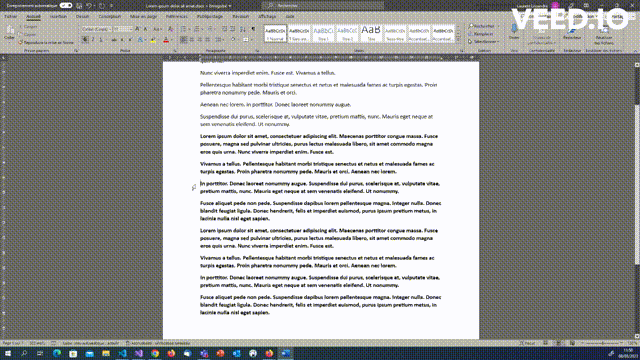

# Raccourcis Windows

Documentation de raccourcis Windows intéressants à connaître pour un développeur.

### Tout sélectionner

**Combinaison de touches :** *CTRL* - *A*

**Description :** Selection de tout le document

**Visuel :** 

**Catégories :** Gestion du texte, MISC

### Copier une sélection de texte, un dossier ou une image

**Combinaison de touches :** *CTRL* - *C* ou *CTRL* - *INSER*

**Description :** Le raccourci permet de copier une sélection de texte, un dossier ou une image. Il faut sélectionner l'élément, maintenir la touche CTRL (Control) du clavier enfoncée et cliquer sur la lettre C.

**Visuel :** 

**Catégories :** Gestion du texte , Gestion du presse-papiers

### Couper

**Combinaison de touches :** *CTRL* -*X*  ou *MAJ* - *suppr*

**Description :** Coupe le texte selectionné dans le presse papier

**Visuel :** 

**Catégories :** Gestion du texte, MISC

### Menu executer

**Combinaison de touches :** *Windows* -*R*

**Description :** Ouvre le menu executer.

**Visuel :** 

**Catégories :**	MISC

### Annuler la dernière modification 

**Combinaison de touches :** *CTRL* - *Z* 

**Description :** Permet d'annuler la dernière modification (répétable)

**Visuel :** 

**Catégories :** MISC

### Placer le curseur en début / fin de ligne

**Combinaison de touches :** *DEBUT*/*FIN*

**Description :** Permet de placer le curseur en début / fin de ligne

**Visuel :** 

**Catégories :** Gestion du texte