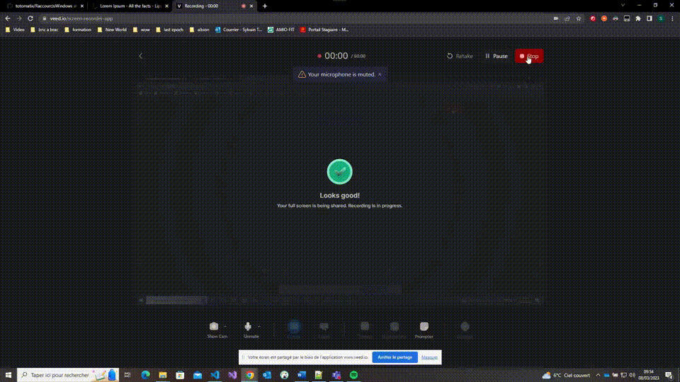

# Raccoucis Windows

<!-- TODO compléter le paragraphe introductif -->
Documentation de raccourcis Windows intéressants à connaître pour un développeur.

### Tout sélectionner

**Combinaison de touches :** *CTRL* - *A*

**Description :** Selection de tout le document

**Visuel :** 

**Catégories :** Gestion du texte, MISC

### Copier une sélection de texte, un dossier ou une image

**Combinaison de touches :** *CTRL* - *C* ou *CTRL* - *INSER*

**Description :** Le raccourci permet de copier une sélection de texte, un dossier ou une image. Il faut sélectionner l'élément, maintenir la touche CTRL (Control) du clavier enfoncée et cliquer sur la lettre C.

**Visuel :** 

**Catégories :** Gestion du texte , Gestion du presse-papiers

### Couper

**Combinaison de touches :** *CTRL* -*X*  ou *MAJ* - *suppr*

**Description :** Coupe le texte selectionné dans le presse papier

**Visuel :** 

**Catégories :** Gestion du texte, MISC

### Menu executer

**Combinaison de touches :** *Windows* -*R*

**Description :** Ouvre le menu executer.

**Visuel :** 

**Catégories :**	MISC

### Annuler la dernière modification 

**Combinaison de touches :** *CTRL* - *Z* 

**Description :** Permet d'annuler la dernière modification (répétable)

**Visuel :** 

**Catégories :** MISC

### Ouvrir la page de propriétés du PC

**Combinaison de touches :** *WIN* - *PAUSE*

**Description :** Permet d'ouvrir la page de propriétés du PC

**Visuel :** 

**Catégories :** MISC

### Ouvrir le menu démarrer

**Combinaison de touches :** *WINDOWS* 

**Description :** Permet d'ouvrir le menu démarrer

**Visuel :** 

**Catégories :** MISC

### Afficher les tâches 

**Combinaison de touches :** *WIN* - *TAB*

**Description :** Permet d'afficher les tâches.

**Visuel :** 

**Catégories :** Gestion du bureau et des fenêtres.

### Naviguation entre les fenêtres

**Combinaison de touches :** *ALT* - *TAB*

**Description :** Permet de naviguer entre les fenêtres

**Visuel :** 

**Catégories :** Gestion du bureau et des fenêtres.

### Sauvegarder le fichier actif 

**Combinaison de touches :** *CTRL* - *S*

**Description :** Permet de sauvegarder le fichier actif 

**Visuel :** 

**Catégories :** MISC

### Renommer l’élément sélectionné

**Combinaison de touches :** *F2*

**Description :** Permet de renommer l’élément sélectionné

**Visuel :** 

### Plein écran

**Combinaison de touches :** *F11*

**Description :** Passer en mode plein écran

**Visuel :** 

**Catégories :**	MISC

### Ouverture explorateur Windows

**Combinaison de touches :** *Windows* - *E*

**Description :** Ouvrir l’explorateur de fichiers Windows  

**Visuel :**   

**Catégories :** Gestion du bureau et des fenetres

### Historique presse papier 

**Combinaison de touches :** *Windows* - *v*

**Description du raccourcis :** Permet d'afficher l'historique du presse papier. Ce qui permet de sélectionner ce que l'on souhaite coller. 

**Visuel :** 

**Categories :** Gestion du presse-papier (C)

### Ouvrir l’outil de capture Windows 

**Combinaison de touches :** *windows* - *Maj* - *S*

**Description du raccourcis :** Permet  d'ouvrir l’outil de capture d'écran  Windows et de sélectionner une partie ou la totalité de l'écran.

**Visuel :** 

**Categories :** MISC

### Naviguer mot par mot 

**Combinaison de touches :** *CTRL* - *TOUCHES DIRECTIONELLE*

**Description du raccourcis :** Permet de naviguer mot par mot 

**Visuel :** 

**Categories :** MISC

### Rechercher dans la page ou application ouverte.

**Combinaison de touches :** (*CTRL* - *F*) ou *F3*

**Description du racourcis :** Permet d'ouvrir l'outil de recherche (comportement peut différer légèrement en fonction de l’application) 

**Visuel :**

**Categories :** MISC