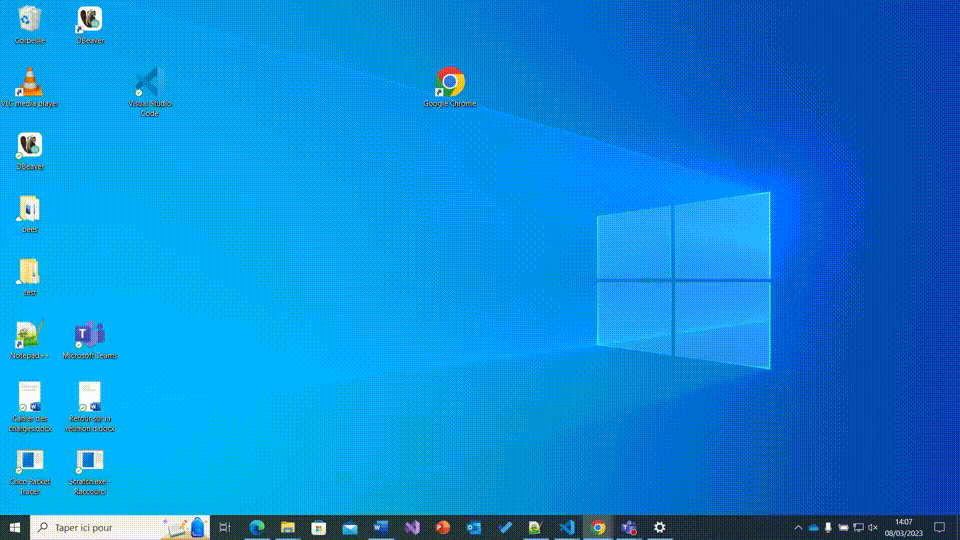

# Raccourcis Windows

<!-- TODO compléter le paragraphe introductif -->
Documentation de raccourcis Windows intéressants à connaître pour un développeur.

### Tout sélectionner

**Combinaison de touches :** *CTRL* - *A*

**Description :** Selection de tout le document

**Visuel :** 

**Catégories :** Gestion du texte, MISC

### Copier une sélection de texte, un dossier ou une image

**Combinaison de touches :** *CTRL* - *C* ou *CTRL* - *INSER*

**Description :** Le raccourci permet de copier une sélection de texte, un dossier ou une image. Il faut sélectionner l'élément, maintenir la touche CTRL (Control) du clavier enfoncée et cliquer sur la lettre C.

**Visuel :** 

**Catégories :** Gestion du texte , Gestion du presse-papiers

### Couper

**Combinaison de touches :** *CTRL* -*X*  ou *MAJ* - *suppr*

**Description :** Coupe le texte selectionné dans le presse papier

**Visuel :** 

**Catégories :** Gestion du texte, MISC

### Menu executer

**Combinaison de touches :** *Windows* -*R*

**Description :** Ouvre le menu executer.

**Visuel :** 

**Catégories :**	MISC

### Annuler la dernière modification 

**Combinaison de touches :** *CTRL* - *Z* 

**Description :** Permet d'annuler la dernière modification (répétable)

**Visuel :** 

**Catégories :** MISC

### Ouvrir la page de propriétés du PC

**Combinaison de touches :** *WIN* - *PAUSE*

**Description :** Permet d'ouvrir la page de propriétés du PC

**Visuel :** 

**Catégories :** MISC

### Ouvrir le menu démarrer

**Combinaison de touches :** *WINDOWS* 

**Description :** Permet d'ouvrir le menu démarrer

**Visuel :** 

**Catégories :** MISC

### Afficher les tâches 

**Combinaison de touches :** *WIN* - *TAB*

**Description :** Permet d'afficher les tâches.

**Visuel :** 

**Catégories :** Gestion du bureau et des fenêtres.

### Naviguation entre les fenêtres

**Combinaison de touches :** *ALT* - *TAB*

**Description :** Permet de naviguer entre les fenêtres

**Visuel :** 

**Catégories :** Gestion du bureau et des fenêtres.

### Verrouiller la session.

**Combinaison de touches :** *WIN* - *L*

**Description :** verrouille la session active

**Visuel :** 

**Catégories :** MISC.
